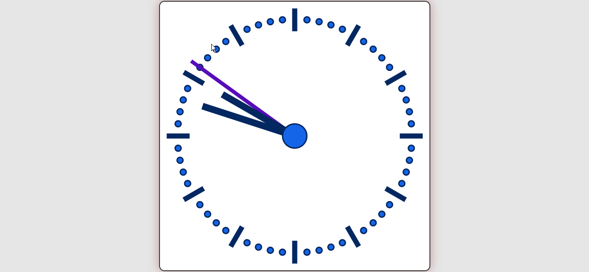
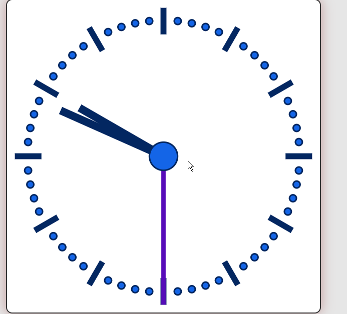

# 🕰️ SVG Clock Project

A simple project showcasing an SVG clock with added styles. 🎨⏰

## 📄 Project Description

This project consists of an SVG clock created using HTML and SVG elements. The styles, including colors, shadows, and positioning, are defined in a separate CSS file. The clock is centered on the screen with a background color, border, and shadow to enhance its appearance.

## 🖼️ Screenshots

| Clock View 1                  | Clock View 2                       |
| ---------------------------------- | ---------------------------------- |
|  |  |

## 🚀 How to Use

1. Clone the repository:

   ```bash
   git clone https://github.com/your-username/svg-clock-project.git
   ```

2. Open the `index.html` file in a web browser.

## 📂 Project Structure

```
svg-clock-project/
│
├── index.html
├── clscript.js
├── styles.css
├── screenshots/
│   ├── 1.png
│   └── 2.png
└── README.md


## 📝 Additional Information

- The clock features a responsive design for various screen sizes. 📱💻
- Feel free to customize the colors and styles in the `styles.css` file to suit your preferences. ✨
- If you encounter any issues or have suggestions for improvement, please open an issue or contribute! 🤝🚀

## 📄 License

This project is licensed under the [MIT License](LICENSE).
```
